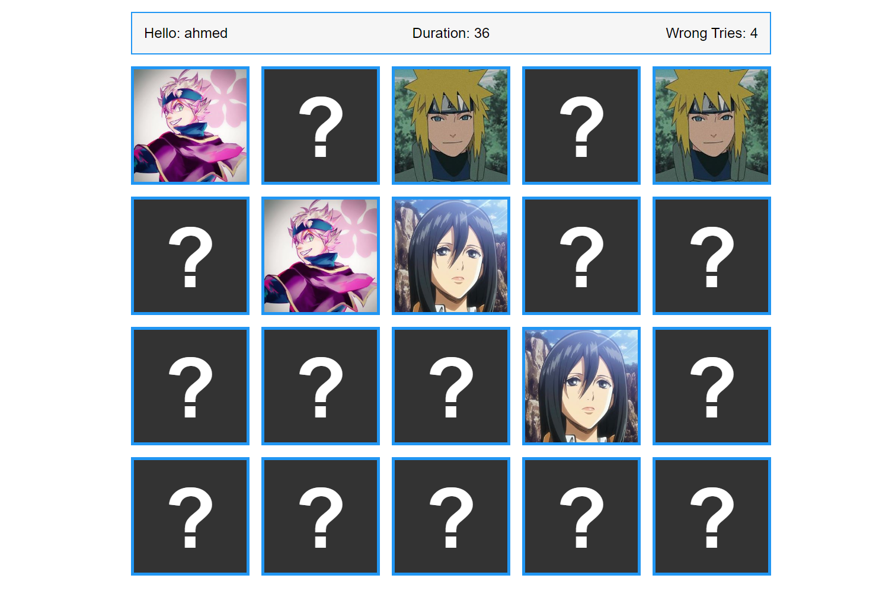

# Memory Game
## Overview:
A JavaScript-based memory game for practicing and enhancing your memory skills. Flip two cards at a time and match identical pairs to win.

## How to Play:

- Click on a card to reveal its symbol.
- Click on another card to find its match.
- If the cards match, they stay flipped; if not, try again.
- Continue until all pairs are successfully matched.

Enjoy the challenge and have fun improving your memory with the Simple Memory Game! 🧠🎮

